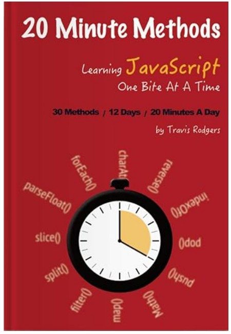

# 20-minute-array-methods

This repository consists of a series of exercises to strengthen (mental muscle) JS array methods. These exercises were prepared by Travis Rodgers.
Note: The 20 minute array hands-on and array exercises does not contain any challenge for:
a) day 5
b) day 7
c) day 8

